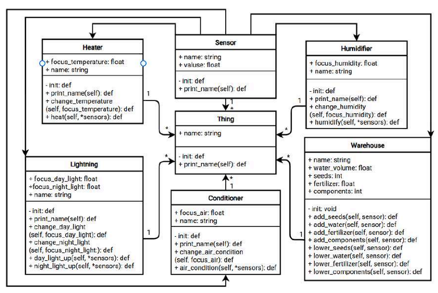

# Iot
<h1 align="center">Итоговый проект по курсу Интернет Вещей</h1>
<h3 align="center">Умная теплица</h3>

<h2>В работе использовались:</h2>
<ul>
    <li>Python</li>
    <li>Flask</li>
    <li>MongoDB</li>
</ul>

<h3 align="center">UML диаграмма классов системы умной теплицы</h3>